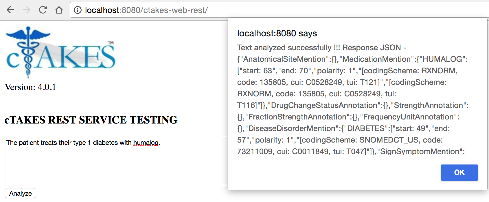

# cTAKES Rest Service

The goal of this solution is to provide a JSON-based REST service to process unstructured clinical text through a smart natural language processing system in a fast, accurate, and easy to setup way.



## Install

_(Based on Ubuntu 18)_

1. Install Java 8 and MySQL 5.7 ([reference](https://support.rackspace.com/how-to/installing-mysql-server-on-ubuntu/))

```bash
sudo apt-get update
sudo apt-get install default-jdk
sudo apt-get install mysql-server
mysqladmin -u root password pass
```

The above sets the ``root`` password to ``pass``. You can also use custom configurations and specify them in `./ctakes-web-rest/src/main/resources/org/apache/ctakes/dictionary/lookup/fast/customDictionary.xml`.

> Note: This repo assumes you installed MySQL on the default port 3066

2. Install Tomcat 8 using the detailed instructions [here](https://linuxize.com/post/how-to-install-tomcat-8-5-on-ubuntu-18.04/))

3. Install Maven 3.5, Subversion, and Git.

```bash
sudo apt-get install maven
sudo apt-get install subversion
sudo apt-get install git
```

4. Git clone this repository: `git clone https://github.com/GoTeamEpsilon/ctakes-rest-service.git`.
5. Load in all SQL scripts in `./sno_rx_16ab_db`. This process may take several hours.

```bash
cd ./sno_rx_16ab_db
for fname in *.sql; do sudo mysql -u root < $fname; done
cd ..
```

6. `cd` into the repository and run the following to pull down cTAKES:

```
mkdir ctakes-codebase-area
cd ctakes-codebase-area
svn export 'https://svn.apache.org/repos/asf/ctakes/trunk'
```

7. Build the appropriate cTAKES modules with the following:

```
cd trunk/ctakes-distribution
mvn install -Dmaven.test.skip=true
cd ../ctakes-assertion-zoner
mvn install -Dmaven.test.skip=true
```

8. Navigate back to the main codebase and build:
```
cd ../../../ctakes-web-rest
mvn install
```

9. Deploy the War file:

```
sudo mv target/ctakes-web-rest.war /opt/tomcat/latest/webapps/

# useful for debugging (uncomment):
# tail -f /opt/tomcat/latest/logs/catalina.out
```

10. Access the URL `http://localhost:8080/ctakes-web-rest/index.jsp` for testing the REST service. This should return a default index page.

11. Test the installation by issuting a POST request to `http://localhost:8080/ctakes-web-rest/service/analyze?pipeline=Default`. You can do this using a client like Postman (remember to use the POST method and RAW response).


## License

Apache License, Version 2.0
